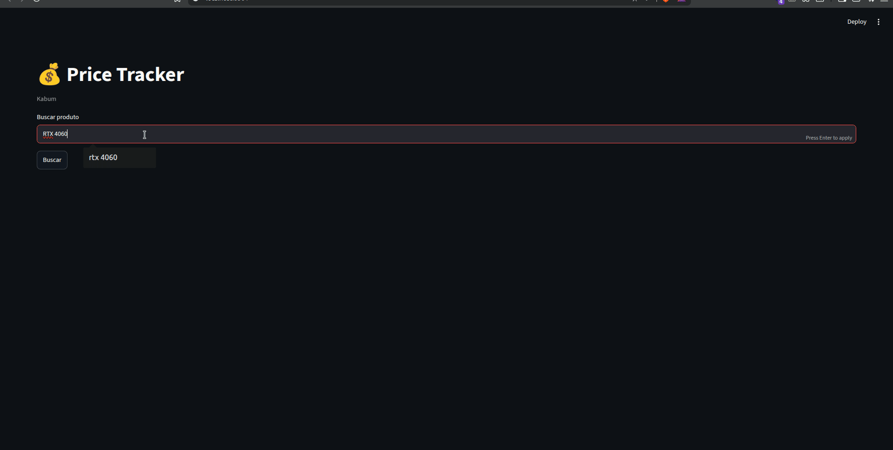

# 🔍 Price Tracker

> Real-time product price tracker for Kabum — built with Python, Playwright, and Streamlit.

> Rastreador de preços em tempo real para o Kabum — construído com Python, Playwright e Streamlit.

---

## 🖥️ Demo



---

## 🚀 Features / Funcionalidades

- 🔎 Search any product and get live results from Kabum
- 📊 Results sorted by price with interactive table
- 📈 Price distribution chart for the top 10 results
- 🔗 Direct links to each product page

---

## 🛠️ Tech Stack

- **Python 3.12**
- **Playwright** — headless browser automation for scraping
- **Pandas** — data manipulation
- **Streamlit** — interactive web dashboard

---

## ⚙️ Installation / Instalação

```bash
# Clone the repository
git clone https://github.com/fiuzer/price-tracker.git
cd price-tracker

# Create and activate virtual environment
python -m venv venv
source venv/bin/activate

# Install dependencies
pip install -r requirements.txt

# Install Playwright browsers
playwright install chromium
```

---

## ▶️ Usage / Como usar

```bash
streamlit run app.py
```

Then open [http://localhost:8501](http://localhost:8501) in your browser, type a product name and click **Buscar**.

---

## 📁 Project Structure

```
price-tracker/
├── app.py              # Streamlit dashboard
├── scrapers/
│   └── kabum.py        # Kabum scraper (Playwright)
├── requirements.txt
└── .gitignore
```

---

## 📌 Notes / Notas

- The scraper runs in headless browser mode with user-agent rotation to avoid detection.
- Search results may vary depending on Kabum's current inventory and page layout.

---

## 👤 Author

**Guilherme Fiuza** — [@fiuzer](https://github.com/fiuzer) • [LinkedIn](https://linkedin.com/in/fiuzer)